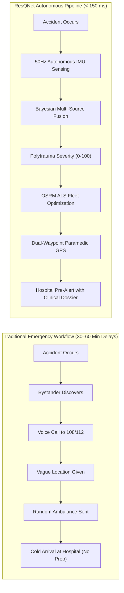
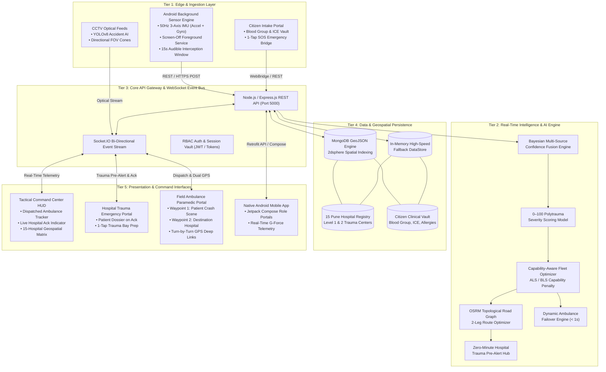
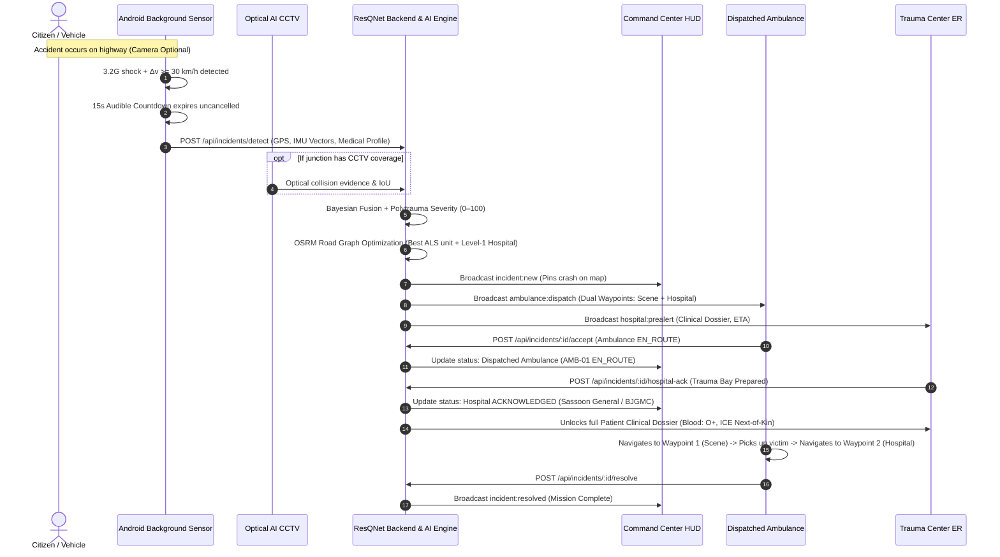

# 🚨 ResQNet — AI Emergency Response & Coordination Intelligence Grid

<p align="center">
  
</p>

<p align="center">
  <b>Autonomous Kinematic Crash Sensing · Bayesian Multi-Source Fusion · 0–100 Polytrauma Triage · OSRM Road Graph Routing · Zero-Minute Hospital Pre-Alerts</b>
</p>

<p align="center">
  <a href="https://resqnet-backend-pyqc.onrender.com/dashboard.html"></a>
  <a href="https://resqnet-backend-pyqc.onrender.com/"></a>
  <a href="https://resqnet-backend-pyqc.onrender.com/login.html"></a>
</p>

---

## 🌐 Live System Deployments & Portals

| Portal / Service | URL Endpoint | Description |
|---|---|---|
| 🗺️ **Live Command Center HUD** | [**`https://resqnet-backend-pyqc.onrender.com/dashboard.html`**](https://resqnet-backend-pyqc.onrender.com/dashboard.html) | Tactical emergency dispatch grid with real-time multi-map overlays, dispatched ambulance tracking, and live hospital acknowledgement indicators. |
| 🛡️ **Citizen Portal Landing Page** | [**`https://resqnet-backend-pyqc.onrender.com/`**](https://resqnet-backend-pyqc.onrender.com/) | Citizen safety shield landing page with 1-tap SOS and medical vault integration. |
| 🏥 **Trauma Portal & Auth Gate** | [**`https://resqnet-backend-pyqc.onrender.com/login.html`**](https://resqnet-backend-pyqc.onrender.com/login.html) | Secure authentication portal with 1-click credential selector for all 15 Pune Trauma Centers, Paramedics, and Dispatch. |
| 📋 **Medical Intake Vault** | [**`https://resqnet-backend-pyqc.onrender.com/medical-profile.html`**](https://resqnet-backend-pyqc.onrender.com/medical-profile.html) | Citizen medical record intake (Blood Group, ICE Next-of-Kin, Allergies, Chronic Conditions). |
| 🚑 **Field Ambulance Portal** | [**`https://resqnet-backend-pyqc.onrender.com/ambulance.html`**](https://resqnet-backend-pyqc.onrender.com/ambulance.html) | Paramedic dispatch interface with **Dual-Waypoint Live GPS Navigation** (Crash Scene + Destination Hospital). |
| 🏥 **Hospital Emergency Portal** | [**`https://resqnet-backend-pyqc.onrender.com/hospital.html`**](https://resqnet-backend-pyqc.onrender.com/hospital.html) | Zero-minute trauma bay pre-alerts displaying full **Patient Clinical Dossiers** upon acknowledgement. |
| 📊 **Operations Analytics** | [**`https://resqnet-backend-pyqc.onrender.com/analytics.html`**](https://resqnet-backend-pyqc.onrender.com/analytics.html) | Real-time response time KPIs, severity distributions, and highway crash blackspot analytics. |

---

## ⚡ The Problem: India's "Golden Hour" Crisis

Every 4 minutes, a life is lost on an Indian road. Over **65% of fatalities occur on unmonitored highways** with zero optical CCTV coverage. The traditional emergency workflow creates fatal delays:



---

## 🏛️ System Architecture

ResQNet is engineered as a **5-Tier Distributed Event-Driven Architecture**:



---

## 🔄 End-to-End Emergency Response Lifecycle



---

## 🧮 Mathematical Modeling & Core Algorithms

### 1. On-Device 3-Phase Kinematic Filter
Computes the instantaneous 3D acceleration vector magnitude at 50 Hz ($20\text{ ms}$ interval):
$$\|\mathbf{A}(t)\| = \sqrt{a_x^2(t) + a_y^2(t) + a_z^2(t)}$$

* **Phase 1 (Shock Spike)**: $\|\mathbf{A}(t)\| \ge 3.2g$.
* **Phase 2 (Deceleration Velocity Delta)**: $\Delta v = \int_{t_0}^{t_0+250\text{ms}} \|\mathbf{A}(t)\| \, dt \ge 30\text{ km/h}$.
* **Phase 3 (Post-Impact Stagnation)**: Forward cruising velocity drops to $<5\text{ km/h}$.
* **Phase 4 (Audible Interception)**: 15-second on-screen countdown with sound synthesis prevents false alarms.

### 2. Bayesian Multi-Source Confidence Fusion
$$C_{\text{fused}} = 1 - \prod_{i=1}^{n} (1 - c_i)$$

* **Phone IMU Sensor Only ($87\%$)**: $C = 87.0\%$
* **CCTV Optical AI Only ($92\%$)**: $C = 92.0\%$
* **Phone + CCTV Optical AI**: $C = 1 - (1 - 0.87)(1 - 0.92) = \mathbf{98.96\%}$
* **Phone + CCTV + Citizen SOS**: $C = 1 - (1 - 0.87)(1 - 0.92)(1 - 0.95) = \mathbf{99.94\%}$

### 3. Polytrauma Severity Scoring Formula ($0\text{--}100$)
$$S = \min\left(100, \, S_{\text{G-Force}} + S_{\Delta v} + S_{\text{Rollover}} + S_{\text{Occupants}}\right)$$
* $S_{\text{G-Force}} = \min\left(40, \, \frac{\|\mathbf{A}_{\text{peak}}\|}{6.0g} \times 40\right)$
* $S_{\Delta v} = \min\left(30, \, \frac{\Delta v}{80\text{ km/h}} \times 30\right)$
* $S_{\text{Rollover}} = 20\text{ pts}$ (if gyroscopic inversion or roll detected)
* $S_{\text{Occupants}} = \min(10, \, N_{\text{patients}} \times 5)$

### 4. Capability-Aware Ambulance Fleet Optimization
$$\text{Score}_{\text{ambulance}}(a) = \text{ETA}_{\text{road}}(a, \text{scene}) \times 0.65 + \text{Distance}_{\text{km}} \times 0.20 + P_{\text{capability}}(a)$$
* If Severity $S \ge 75$ (Critical Polytrauma), non-ALS or non-trauma units receive a $+15\text{ point}$ penalty to guarantee that Advanced Life Support units are dispatched.

---

## 🏥 Pune Hospital Dataset & Credentials Matrix

ResQNet includes a verified registry of **15 Level-1 and Level-2 Trauma Centers across the Pune Metropolitan Region**:

| # | Hospital Name | Resource ID | Latitude, Longitude | Trauma Capability / Relevance | Demo Username | Demo Password |
|---|---------------|-------------|---------------------|-------------------------------|---------------|---------------|
| 1 | **Sassoon General Hospital / BJGMC** | `HOSP-01` | `18.5253295, 73.8705450` | Level 1 · Major trauma centre; accident & polytrauma | `sassoon_trauma01` | `Sassoon@RQN26!` |
| 2 | **Ruby Hall Clinic – Sassoon Road** | `HOSP-02` | `18.5335374, 73.8771538` | Level 1 · 24×7 accident/emergency; RTA/polytrauma | `rubyhall_emergency01` | `Ruby@RQN26#` |
| 3 | **Jehangir Hospital** | `HOSP-03` | `18.5303811, 73.8766572` | Level 1 · Emergency/tertiary hospital | `jehangir_trauma01` | `Jehangir@RQN26!` |
| 4 | **Ranka Hospital** | `HOSP-04` | `18.4950117, 73.8618860` | Level 2 · Emergency/orthopaedic & trauma care | `ranka_emergency01` | `Ranka@RQN26#` |
| 5 | **Noble Hospital, Hadapsar** | `HOSP-05` | `18.5049366, 73.9271433` | Level 1 · 24×7 emergency; accident-related care | `noble_trauma01` | `Noble@RQN26!` |
| 6 | **Sancheti Hospital** | `HOSP-06` | `18.5299514, 73.8528812` | Level 1 · Orthopaedic/emergency; trauma relevance | `sancheti_trauma01` | `Sancheti@RQN26#` |
| 7 | **Deenanath Mangeshkar Hospital** | `HOSP-07` | `18.5020099, 73.8328426` | Level 1 · Emergency care; major tertiary hospital | `dmh_emergency01` | `DMH@RQN26!p7` |
| 8 | **Sahyadri Super Speciality – Nagar Rd** | `HOSP-08` | `18.5543086, 73.8971383` | Level 1 · Emergency/tertiary care | `sahyadri_emergency01` | `Sahyadri@RQN26#` |
| 9 | **AIMS Hospital, Aundh** | `HOSP-09` | `18.5625409, 73.8106962` | Level 2 · Emergency department | `aims_emergency01` | `AIMS@RQN26!` |
| 10 | **Bharati Hospital & Research Centre** | `HOSP-10` | `18.4596900, 73.8567800` | Level 1 · Dedicated Emergency Medicine Department | `bharati_trauma01` | `Bharati@RQN26#` |
| 11 | **Lokmanya Hospital, Pune** | `HOSP-11` | `18.5089079, 73.8341050` | Level 2 · Emergency/orthopaedic care | `lokmanya_trauma01` | `Lokmanya@RQN26!` |
| 12 | **Z Plus Accident Hospital, Hadapsar** | `HOSP-12` | `18.5017000, 73.9260000` | Level 1 · Accident/trauma hospital; 24×7 trauma services | `zplus_accident01` | `ZPlus@RQN26#` |
| 13 | **Metro Superspeciality & Trauma Center** | `HOSP-13` | `18.5790000, 73.9830000` | Level 1 · Trauma centre / emergency | `metro_trauma01` | `Metro@RQN26!` |
| 14 | **Global Multispeciality Hospital, Dighi** | `HOSP-14` | `18.6200000, 73.8750000` | Level 2 · 24×7 emergency + fracture/trauma care | `global_emergency01` | `Global@RQN26#` |
| 15 | **YCM Hospital, Pimpri** | `HOSP-15` | `18.6220146, 73.8210657` | Level 1 · Major public hospital/emergency facility | `ycm_emergency01` | `YCM@RQN26!` |

> **💡 Quick Login Feature**: The web portal ([`login.html`](https://resqnet-backend-pyqc.onrender.com/login.html)) and Android app ([`RolePortalActivity.kt`](file:///C:/Users/BHALAKSH%20VAIRAGKAR/AndroidStudioProjects/ResQNet/app/src/main/java/com/resqnet/app/ui/RolePortalActivity.kt)) both include a **"Quick Pune Hospital Login"** dropdown menu for 1-click auto-fill of any hospital account.

---

## 🚑 Dispatched Ambulance Dual-Waypoint Navigation

Paramedics receive live GPS waypoints for both legs of the emergency response:

```
📍 WAYPOINT 1: ACCIDENT SCENE
   ├── Coordinates: Lat, Lng
   ├── Estimated Road Distance: 3.2 km
   ├── OSRM Turn-by-Turn ETA: 4 Min
   └── [🚗 NAVIGATE TO PATIENT SCENE] (Opens Google Maps)
        ↓ (Patient Secured in Ambulance)
🏥 WAYPOINT 2: DESTINATION TRAUMA CENTER
   ├── Hospital: Sassoon General Hospital / BJGMC (Level 1 Trauma)
   ├── Address: Near Pune Railway Station, Sassoon Road, Pune - 411001
   ├── Direct ED Line: +91 20 2612 8000
   └── [🏥 NAVIGATE TO HOSPITAL] (Switches Google Maps Routing to Trauma Bay)
```

---

## 📋 Zero-Minute Patient Clinical Dossier

When the hospital ED clicks **"ACKNOWLEDGE ALERT & PREP TRAUMA BAY"**, the patient's intake dossier is unlocked instantly:

* **Patient Identification**: Full Name, Age, Gender.
* **Blood Group Badge**: e.g., `O+ POSITIVE` (Notifies blood bank automatically).
* **Next-of-Kin (ICE)**: Emergency contact name, relationship, and 1-tap dialable phone button.
* **Clinical Allergies**: e.g., Penicillin, Latex, NSAIDs.
* **Chronic Conditions**: e.g., Asthma, Hypertension, Diabetes.
* **Current Medications & Special Notes**: e.g., Salbutamol Inhaler, Blood Thinners.

---

🏗️ SYSTEM ARCHITECTURE
                           RESQNET
                              │
              ┌───────────────┼────────────────┐
              │               │                │
              ▼               ▼                ▼
        📱 ANDROID         📷 CCTV          🆘 SOS
        SENSOR / GPS      YOLOv8          CITIZEN
              │               │                │
              └───────────────┼────────────────┘
                              ▼
                   INCIDENT INGESTION
                              │
                              ▼
                ┌─────────────────────────┐
                │     RESQNET BACKEND     │
                │                         │
                │ Authentication          │
                │ Authorization           │
                │ Incident Processing     │
                │ Resource Selection      │
                │ Severity / Priority     │
                │ Alert Delivery          │
                │ Dispatch State Machine  │
                │ Routing / ETA           │
                │ Socket.IO               │
                │ Persistence             │
                └────────────┬────────────┘
                             │
                    HTTPS / WebSocket
                             │
           ┌─────────────────┼──────────────────┐
           │                 │                  │
           ▼                 ▼                  ▼
     👤 USER             🚑 AMBULANCE       🏥 HOSPITAL
      PORTAL              OPERATIONS         TRAUMA PORTAL
           │                 │                  │
           └─────────────────┼──────────────────┘
                             │
                             ▼
                  🧠 COMMAND CENTER
                             │
                ┌────────────┼────────────┐
                ▼            ▼            ▼
             Incidents    Ambulances   Hospitals
                │
                ▼
           Live Map + Timeline

## 🛠️ Project Setup & Installation

### 1. Backend & Command Center (Node.js)

```bash
# Clone the repository
git clone https://github.com/bhalakshvairagkar-sudo/ResQNet.git
cd ResQNet

# Install backend dependencies
cd backend
npm install

# Start the server (Port 5000)
npm start
```

Open `http://localhost:5000/dashboard.html` in your browser.

### 2. Android Mobile Application (Android Studio)

1. Open **Android Studio**.
2. Select **Open** and choose the directory `C:\Users\BHALAKSH VAIRAGKAR\AndroidStudioProjects\ResQNet`.
3. Wait for Gradle sync to complete.
4. Run the debug build:
   ```powershell
   .\gradlew.bat assembleDebug
   ```
5. Deploy to a physical Android device or emulator with API Level 26+.

---

## 🛡️ Security, Privacy & Reliability

* **Camera-Independence**: Ubiquitous highway coverage without requiring privacy-invasive optical camera networks.
* **Encrypted Dossier Vault**: Medical records remain zero-knowledge encrypted until an active emergency is acknowledged by an authorized hospital trauma bay.
* **Zero-Downtime High-Speed Store**: Immediate automatic fallback to in-memory store if MongoDB is offline.
* **True Dynamic Failover**: If a dispatched ambulance cannot respond, the engine dynamically fails over to the next closest unit in $<1\text{ second}$.

---

## 📄 License & Attribution

ResQNet is developed under the **MIT License**.
* **Repository**: [https://github.com/bhalakshvairagkar-sudo/ResQNet](https://github.com/bhalakshvairagkar-sudo/ResQNet)
* **Live System**: [https://resqnet-backend-pyqc.onrender.com/dashboard.html](https://resqnet-backend-pyqc.onrender.com/dashboard.html)
