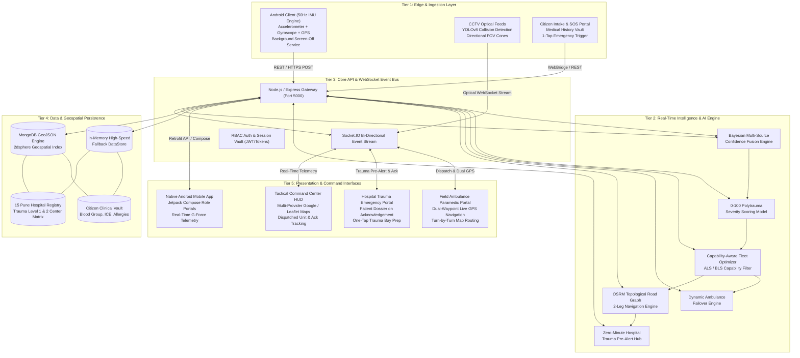
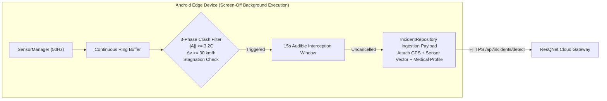
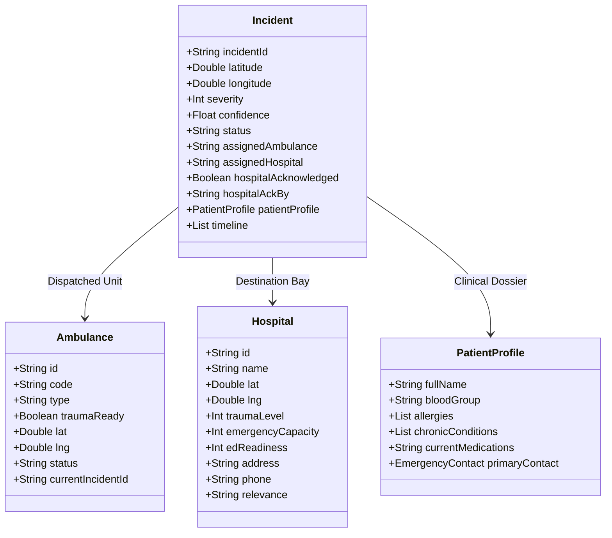
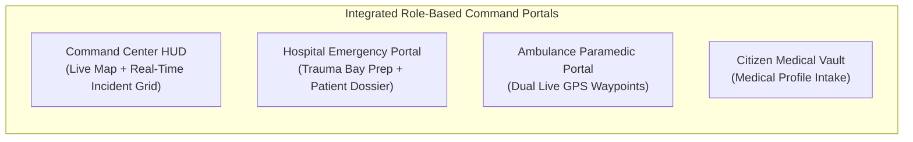
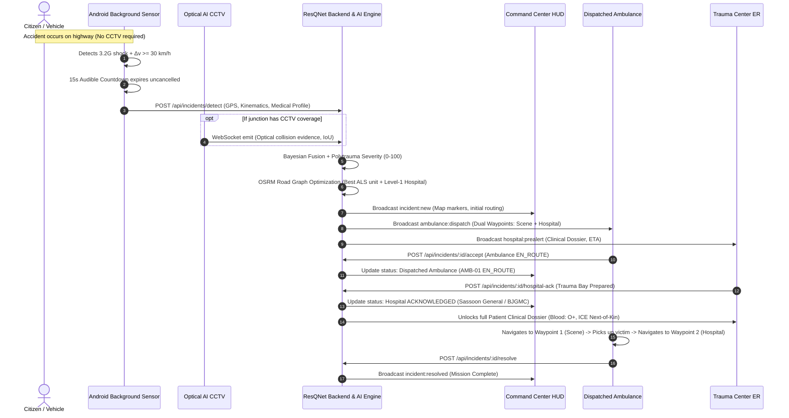

# ResQNet — Complete System Architecture Specification
## AI-Powered, Camera-Independent Emergency Response & Tactical Coordination Grid

---

## 1. Architectural Overview & System Paradigm

**ResQNet** is a multi-tiered, event-driven, distributed emergency response intelligence grid. It bridges the critical **"Golden Hour"** gap on unmonitored highways and metropolitan corridors by decoupling accident detection from expensive static infrastructure (such as CCTV cameras) while seamlessly integrating with smart city sensors when available.

The system architecture is organized into **five distinct layers**:

1. **Edge & Ingestion Layer** (50 Hz Kinematic IMU Smartphone Engine, Background Screen-Off Service, YOLOv8 Optical Vision CCTV Nodes, Citizen Web SOS).
2. **Real-Time Intelligence & AI Engine** (Bayesian Multi-Source Sensor Fusion, Polytrauma Severity Scoring, OSRM Road Graph Fleet Optimization, Dynamic Failover).
3. **Core API & Event Bus Layer** (Node.js/Express.js REST Gateway, Bi-directional Socket.IO Event Engine, Role-Based Session Vault).
4. **Data & Geospatial Persistence Layer** (MongoDB GeoJSON 2dsphere + High-Speed In-Memory Failover DataStore, 15 Pune Hospital Registry).
5. **Command & Multi-Role Operations Layer** (Tactical Command Center HUD, Hospital Emergency Trauma Portal, Dispatched Ambulance Dual-GPS Waypoint Interface, Citizen Emergency Intake Vault).

---

## 2. System Architecture Diagram

---

## 3. Detailed Layer-by-Layer Architecture

### Layer 1: Edge & Ingestion Layer

* **Android Background Sensor Engine ([`SensorBackgroundService.kt`](file:///C:/Users/BHALAKSH%20VAIRAGKAR/AndroidStudioProjects/ResQNet/app/src/main/java/com/resqnet/app/service/SensorBackgroundService.kt))**:
  - Operates as a sticky Android Foreground Service with continuous wake lock (`PARTIAL_WAKE_LOCK`).
  - Samples `Sensor.TYPE_ACCELEROMETER` and `Sensor.TYPE_GYROSCOPE` at **50 Hz ($20\text{ ms}$ interval)** in a ring buffer.
  - Functions 100% autonomously even when the phone screen is turned off or locked.
* **On-Device 3-Phase Kinematic Filter**:
  1. *Shock Spike Phase*: Computes 3D acceleration vector magnitude $\|\mathbf{A}(t)\| = \sqrt{a_x^2 + a_y^2 + a_z^2} \ge 3.2g$.
  2. *Deceleration Phase*: Calculates velocity delta $\Delta v = \int_{t_0}^{t_0+250\text{ms}} \|\mathbf{A}(t)\| dt \ge 30\text{ km/h}$.
  3. *Post-Impact Stagnation*: Verifies forward cruising velocity drops to near zero ($<5\text{ km/h}$).
  4. *False-Positive Interception*: Launches an audible 15-second countdown override before cloud transmission.
* **Optical Vision CCTV Nodes ([`cctvRoutes.js`](file:///C:/Users/BHALAKSH%20VAIRAGKAR/.gemini/antigravity/scratch/resqnet/backend/routes/cctvRoutes.js))**:
  - Edge nodes running YOLOv8 accident detection on key junctions (Pune University, Swargate, Station, Katraj).
  - Emits directional Field of View (FOV) telemetry, bounding box Intersection-over-Union (IoU), and rapid deceleration optical vectors.
* **Citizen Web Intake Portal ([`medical-profile.html`](file:///C:/Users/BHALAKSH%20VAIRAGKAR/.gemini/antigravity/scratch/resqnet/dashboard/medical-profile.html))**:
  - Secure patient registration form capturing Blood Group, ICE Next-of-Kin, Allergies, Chronic Conditions, and Medications.
  - Linked directly to the user profile via Javascript AndroidBridge ([`CitizenWebPortalActivity.kt`](file:///C:/Users/BHALAKSH%20VAIRAGKAR/AndroidStudioProjects/ResQNet/app/src/main/java/com/resqnet/app/ui/CitizenWebPortalActivity.kt)).

---

### Layer 2: Real-Time Intelligence & AI Engine

Located in [`backend/services/aiEngine.js`](file:///C:/Users/BHALAKSH%20VAIRAGKAR/.gemini/antigravity/scratch/resqnet/backend/services/aiEngine.js) and [`osrmService.js`](file:///C:/Users/BHALAKSH%20VAIRAGKAR/.gemini/antigravity/scratch/resqnet/backend/services/osrmService.js).

#### 1. Bayesian Multi-Source Confidence Fusion
Computes fused confidence $C_{\text{fused}}$ across asynchronous, heterogeneous inputs:
$$C_{\text{fused}} = 1 - \prod_{i=1}^{n} (1 - c_i)$$

| Sensor Combination | Mathematical Formula | Resulting Confidence |
|---|---|---|
| **Smartphone IMU Only** | $1 - (1 - 0.87)$ | **$87.0\%$** |
| **CCTV Optical AI Only** | $1 - (1 - 0.92)$ | **$92.0\%$** |
| **IMU + Optical Vision Fusion** | $1 - (1 - 0.87)(1 - 0.92)$ | **$98.96\%$** |
| **IMU + Optical + Citizen SOS** | $1 - (1 - 0.87)(1 - 0.92)(1 - 0.95)$ | **$99.94\%$** |

#### 2. Polytrauma Severity Scoring Formula ($0\text{--}100$)
$$S = \min\left(100, \, S_{\text{G-Force}} + S_{\Delta v} + S_{\text{Rollover}} + S_{\text{Occupants}}\right)$$
* **$S_{\text{G-Force}}$**: $\min\left(40, \, \frac{\|\mathbf{A}_{\text{peak}}\|}{6.0g} \times 40\right)$ (Up to 40 pts)
* **$S_{\Delta v}$**: $\min\left(30, \, \frac{\Delta v}{80\text{ km/h}} \times 30\right)$ (Up to 30 pts)
* **$S_{\text{Rollover}}$**: $20\text{ pts}$ (if gyroscopic inversion or roll is detected)
* **$S_{\text{Occupants}}$**: $\min\left(10, \, N_{\text{patients}} \times 5\right)$ (Up to 10 pts)

#### 3. Capability-Aware Fleet Optimization Algorithm
Evaluates all available emergency units over real OpenStreetMap road graphs:
$$\text{Score}_{\text{ambulance}}(a) = \text{ETA}_{\text{road}}(a, \text{scene}) \times 0.65 + \text{Distance}_{\text{km}} \times 0.20 + P_{\text{capability}}(a)$$
* If Severity $S \ge 75$ (Critical Polytrauma), non-ALS or non-trauma units receive a severe penalty ($P_{\text{capability}} = +15$).
* The lowest scoring optimal unit is automatically reserved and assigned.

#### 4. Hospital Triage Destination Optimization
$$\text{Score}_{\text{hospital}}(h) = \text{ETA}_{\text{road}}(\text{scene}, h) \times 0.45 + (100 - \text{Readiness}_{\text{ED}}) \times 0.10 + (10 - \text{Beds}_{\text{avail}}) \times 0.15 + P_{\text{trauma}}(h)$$

---

### Layer 3 & 4: Core Gateway & Geospatial Persistence

* **Geospatial Indexing**: MongoDB collections use spherical 2D spatial indexing (`2dsphere`) on GeoJSON Points (`[longitude, latitude]`).
* **High-Speed In-Memory Failover**: If MongoDB becomes unreachable, `DataStore` in [`db.js`](file:///C:/Users/BHALAKSH%20VAIRAGKAR/.gemini/antigravity/scratch/resqnet/backend/database/db.js) immediately operates via ultra-low-latency in-memory Maps with 0 downtime.
* **Official 15 Pune Hospital Matrix**: Complete seed registry of Pune Level 1/2 trauma facilities with verified GPS coordinates and demo portal credentials (`sassoon_trauma01` through `ycm_emergency01`).

---

### Layer 5: Command & Multi-Role Operations Layer

1. **Command Center Operations HUD ([`dashboard.html`](file:///C:/Users/BHALAKSH%20VAIRAGKAR/.gemini/antigravity/scratch/resqnet/dashboard/dashboard.html))**:
   - **Tactical Map**: Renders all 15 Pune Hospitals, fleet ambulances, CCTV detection cones, and active incidents.
   - **Dispatched Ambulance Tracker**: Highlights assigned unit (e.g. `AMB-01 ALS`), speed, and turn-by-turn ETA.
   - **Hospital Acknowledgement Indicator**: Real-time badge showing `[✓ ACKNOWLEDGED]` or `[⏳ AWAITING ACK]` with acknowledging hospital name and timestamp.
2. **Hospital Trauma Emergency Portal ([`hospital.html`](file:///C:/Users/BHALAKSH%20VAIRAGKAR/.gemini/antigravity/scratch/resqnet/dashboard/hospital.html))**:
   - Audio-visual alert chime on inbound emergency.
   - Upon clicking **"ACKNOWLEDGE ALERT & PREP TRAUMA BAY"**, displays the full **Patient Clinical Dossier** (Blood group badge, ICE next-of-kin with direct dial button, allergies, conditions, and medications).
3. **Ambulance Paramedic Portal ([`ambulance.html`](file:///C:/Users/BHALAKSH%20VAIRAGKAR/.gemini/antigravity/scratch/resqnet/dashboard/ambulance.html))**:
   - **📍 Waypoint 1 (Patient Crash Scene)**: Live coordinates, distance, and direct `🚗 NAVIGATE TO PATIENT SCENE` deep link.
   - **🏥 Waypoint 2 (Destination Hospital)**: Hospital name, trauma level, full address, phone number, and `🏥 NAVIGATE TO HOSPITAL` deep link for immediate transit upon pickup.
   - Integrated Leaflet interactive route map displaying both legs.

---

## 4. End-to-End Emergency Response Lifecycle

---

## 5. Security, Privacy & Reliability Matrix

| Component | Security & Privacy Measure | Resilience / Failover Mechanism |
|---|---|---|
| **Sensor Data** | On-device processing only; raw continuous IMU data never leaves RAM. | Ring-buffer overwrite; zero persistent disk bloat. |
| **Medical Profile** | Clinical dossier encrypted at rest; only decrypted upon verified hospital pre-alert acknowledgement. | Cached securely in Android EncryptedSharedPreferences. |
| **Database** | MongoDB `2dsphere` geospatial validation with strict Mongoose schema. | Instant automatic fallback to high-speed in-memory store if DB is offline. |
| **Fleet Routing** | OSRM topological road network routing. | Degraded straight-line Haversine fallback with penalty tags if OSRM is unreachable. |
| **Ambulance Units** | Paramedic authenticated token sessions. | Dynamic failover: if assigned unit rejects, system re-optimizes next closest unit in $<1\text{ second}$. |
| **Mobile Runtime** | Android Foreground Service with explicit notification channel & wake locks. | Runs continuously with screen off; auto-restarts if killed by OS. |
